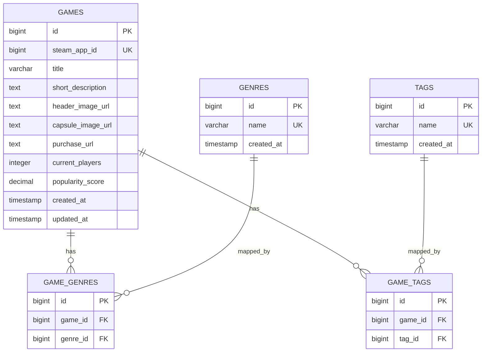

# ERD (MVP v1)

## Scope
- ROOT: 검색 진입 + 인기 게임 노출
- LIST: 검색 결과 + 장르/태그 필터 + 정렬
- DETAIL: 설명 + 구매 링크 + 유사 게임

현재 MVP에서는 아래를 제외한다.
- 회원/인증, 리뷰, 즐겨찾기, 관리자, AI 전용 테이블

## Tables
- `games`
- `genres`
- `game_genres`
- `tags`
- `game_tags`

## Mermaid ERD

## Why This Shape
- `games`: ROOT/LIST/DETAIL 공통 기본 정보 저장
- `genres`, `tags`: 필터 값과 상세 표시 값의 마스터
- `game_genres`, `game_tags`: 다대다 관계를 위한 연결 테이블

## Removed As Non-MVP Columns
아래 컬럼은 3페이지 MVP 요구사항에서 직접 사용되지 않아 기본 스키마에서 제외했다.
- `min_players`, `max_players`
- `release_date`
- `is_free`
- `developer`, `publisher`

## API Field Mapping Check
### ROOT (`GET /api/v1/games/popular`)
- `games.id`, `games.steam_app_id`, `games.title`
- `games.capsule_image_url`
- `games.current_players`, `games.popularity_score`

### LIST (`GET /api/v1/games`)
- ROOT 필드 +
- `genres.name` (via `game_genres`)
- `tags.name` (via `game_tags`)
- 검색: `games.title`
- 정렬: `games.popularity_score`, `games.current_players`, `games.title`

### DETAIL (`GET /api/v1/games/{gameId}`)
- `games.title`, `games.short_description`
- `games.header_image_url`, `games.capsule_image_url`
- `games.purchase_url`
- `games.current_players`, `games.popularity_score`
- `genres.name`, `tags.name`

### SIMILAR (`GET /api/v1/games/{gameId}/similar`)
- 비교 기준: 같은 장르 수 + 같은 태그 수 + `popularity_score` 보정
- 출력 필드: 카드용 최소 필드(`id`, `title`, `capsule_image_url`, `current_players`, `genres`, `tags`)

## Relationship Rules
- `game_genres`: `UNIQUE(game_id, genre_id)`
- `game_tags`: `UNIQUE(game_id, tag_id)`
- 연결 테이블 FK는 `ON DELETE CASCADE` 유지

## Index Notes
- `games(title)`
- `games(current_players)`
- `games(popularity_score)`
- `game_genres(genre_id)`
- `game_tags(tag_id)`
